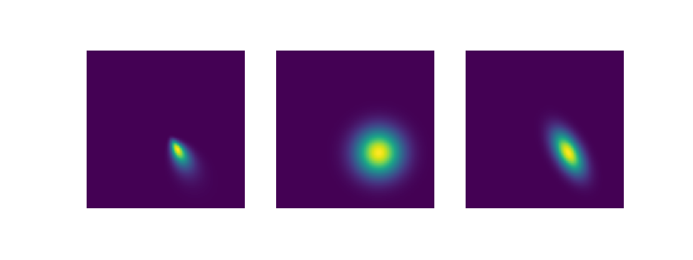

.. pRFpy documentation master file, created by
   sphinx-quickstart on Sun Mar 31 19:28:27 2019.
   You can adapt this file completely to your liking, but it should at least
   contain the root `toctree` directive.

Welcome to pRFpy's documentation!
=================================

pRFpy is a package that allows you to simulate and fit population receptive field (pRF) parameters from time series data.
We have big plans for pRFpy, and will be developing intensely in the coming months. 

.. toctree::
   :maxdepth: 2
   :caption: Reference

   rf
   timecourse
   stim
   grid
   fit
   cnn
   
.. toctree::
   :maxdepth: 2
   :caption: Indices and tables
   * :ref:`genindex`
   * :ref:`modindex`
   * :ref:`search`
